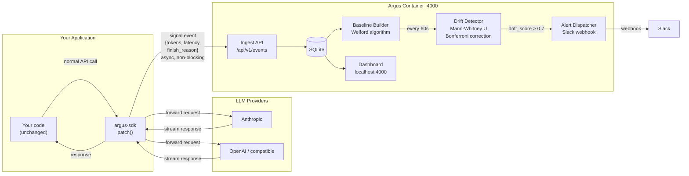

# Argus

Argus tells you when your LLM's behavior has changed — before your users do.

Wrap your existing client with one line. Run one Docker container. Get a live dashboard showing statistical drift across token counts, latency, refusal rates, and output length. Fires a Slack alert when something shifts.

Works with Anthropic, OpenAI, and any OpenAI-compatible provider. Self-hosted, no data leaves your machine.

## Quick Start

```bash
docker run -p 4000:4000 -v argus_data:/data argus/argus
```

```bash
pip install argus-sdk
```

```python
from argus_sdk import patch
patch(endpoint="http://localhost:4000")

import anthropic
client = anthropic.Anthropic()  # unchanged from here
```

Open [localhost:4000](http://localhost:4000) to see your dashboard.

## System Design



**How it works:**

1. `patch()` wraps your existing LLM client — requests and responses flow through unchanged
2. After each response, the SDK posts a signal event to the Argus container in the background (non-blocking)
3. The server builds a statistical baseline from the first 200 requests per model
4. Every 60 seconds it runs a Mann-Whitney U test comparing recent requests against the baseline
5. If the drift score crosses 0.7, a Slack alert fires and the dashboard updates

No prompt text or completion text ever leaves your app — only derived signals (token counts, latency, finish reason).

## Development

Requirements: Python 3.12+, Go 1.23+, Node 20+, Docker

```bash
make sdk-install   # set up Python SDK
make server-build  # build Go server
make ui-install    # install dashboard deps
```

## Project Structure

```
sdk/        Python package (pip install argus-sdk)
server/     Go server — ingest, drift detection, SQLite
ui/         Next.js dashboard
deploy/     Dockerfile
docs/       Documentation
```
