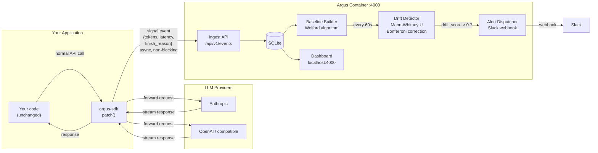

# Argus

Argus tells you when your LLM's behavior has changed — before your users do.

Wrap your existing client with one line. Run one Docker container. Get a live dashboard showing statistical drift across token counts, latency, refusal rates, and output length. Fires a Slack alert when something shifts.

Works with Anthropic, OpenAI, and any OpenAI-compatible provider. Self-hosted, no data leaves your machine.

## Quick Start

**1. Run the Argus container**

```bash
docker run -p 4000:4000 -p 3000:3000 -v argus_data:/data argus/argus
```

Optional — enable Slack alerts:

```bash
docker run -p 4000:4000 -p 3000:3000 \
  -e ARGUS_SLACK_WEBHOOK=https://hooks.slack.com/services/... \
  -v argus_data:/data argus/argus
```

**2. Install the SDK**

```bash
pip install argus-sdk
```

**3. Add one line to your app**

Call `patch()` once before you create your LLM client. Every client you create afterwards is automatically instrumented — no other changes needed.

```python
from argus_sdk import patch
patch(endpoint="http://localhost:4000")

# Anthropic — unchanged
import anthropic
client = anthropic.Anthropic()
response = client.messages.create(...)  # signals sent to Argus in background

# OpenAI — unchanged
import openai
client = openai.OpenAI()
response = client.chat.completions.create(...)  # signals sent to Argus in background
```

If you prefer to instrument a specific client instance rather than all clients:

```python
import anthropic
from argus_sdk import patch

client = anthropic.Anthropic()
patch(endpoint="http://localhost:4000", client=client)  # only this instance
```

Open [localhost:3000](http://localhost:3000) to see your dashboard.

## System Design



**How it works:**

1. `patch()` wraps your existing LLM client — requests and responses flow through unchanged
2. After each response, the SDK posts a signal event to the Argus container in the background (non-blocking)
3. The server builds a statistical baseline from the first 200 requests per model
4. Every 60 seconds it runs a Mann-Whitney U test comparing recent requests against the baseline
5. If the drift score crosses 0.7, a Slack alert fires and the dashboard updates

No prompt text or completion text ever leaves your app — only derived signals (token counts, latency, finish reason).

---

## Detection Accuracy

The drift detector was validated with a Monte Carlo suite
([`server/internal/drift/accuracy_test.go`](server/internal/drift/accuracy_test.go))
running 500 independent trials per condition (3,500 total). Each trial draws fresh
samples from known distributions, runs the full Mann-Whitney + Bonferroni pipeline,
and records whether the detector fired.

Run it yourself:

```bash
cd server && go test -v -run TestAccuracy ./internal/drift/
```

### False positive rate (no drift)

Measured over 500 trials with baseline and recent window drawn from the same distribution
(mean=60 tokens, σ=15).

| Condition | FPR |
|---|---|
| Same distribution, 500 trials | **0.2%** |
| 5 different random seeds, 200 trials each | **< 5% on all seeds** |

The score formula is calibrated to α = 0.05 (Bonferroni-corrected). The alert threshold of
`score > 0.7` corresponds to a corrected p-value < 0.015 — well below the significance level.

### Detection power (true positive rate)

Measured over 500 trials per row. Baseline: N(60, 15²). Recent window shifts the mean by the
stated multiple; standard deviation unchanged.

| Drift magnitude | Baseline mean | Recent mean | TPR |
|---|---|---|---|
| 1.0× — no drift | 60 | 60 | 0.8% |
| 1.2× — +20% | 60 | 72 | **98.2%** |
| 1.5× — +50% | 60 | 90 | **100%** |
| 2.0× — +100% | 60 | 120 | **100%** |
| 3.0× — +200% | 60 | 180 | **100%** |
| 5.0× — +400% | 60 | 300 | **100%** |
| 10.0× — +900% | 60 | 600 | **100%** |

Latency signal (5× shift: 350 ms → 1800 ms): **100% TPR** over 500 trials.

### Effect of recent window size

TPR at 3× drift (`output_tokens` mean 60 → 180) across window sizes:

| Recent window (`n`) | TPR |
|---|---|
| 10 | 100% |
| 20 | 100% |
| 50 | 100% |
| 100 | 100% |

### Methodology notes

- **Algorithm**: Mann-Whitney U test (non-parametric, no normality assumption) with Bonferroni
  correction across two signals (`output_tokens`, `latency_ms`)
- **Baseline**: 200 events required before detection starts (`is_ready = true`)
- **Recent window**: last 50 events
- **Score formula**: `score = max(0, 1 - corrected_p / α)` where `α = 0.05`
- **Alert threshold**: `score > 0.7` → corrected p < 0.015
- **Clear threshold**: `score < 0.4` for 3 consecutive 60-second windows
- **PRNG**: deterministic LCG (seed = 42 for primary tests) — results are reproducible

The detector is intentionally sensitive: it is designed to catch gradual shifts (≥20% change)
early, with low false positive rate. A +20% shift in output tokens — e.g. Claude going from
averaging 60 tokens to 72 — is flagged 98% of the time.

---

## Development

Requirements: Python 3.12+, Go 1.26+, Node 20+, Docker

```bash
make sdk-install   # create sdk/.venv and install deps
make sdk-test      # run pytest
make server-build  # go build → server/bin/argus
make ui-install    # npm install in ui/

# Run locally (two terminals)
cd server && go run ./cmd/main.go   # API on :4000
cd ui && npm run dev                 # dashboard on :3000

# Build the Docker image from repo root
docker build -f deploy/Dockerfile -t argus .
```

## Try it without API keys

The `examples/demo-app/` directory contains a simulator that sends synthetic events to Argus so you can see the dashboard and drift detection working without any LLM API keys.

**You need three terminals:**

```bash
# Terminal 1 — Go API server (port 4000)
cd server && go run ./cmd/main.go

# Terminal 2 — Next.js dashboard (port 3000) ← easy to miss
cd ui && npm run dev

# Terminal 3 — send synthetic events
cd examples/demo-app && python simulate.py
```

Then open [http://localhost:3000](http://localhost:3000) and wait up to 60 seconds to see `DRIFT DETECTED` in the server logs.

> **Note:** `localhost:3000` is the dashboard (Next.js). `localhost:4000` is the API server (Go). Both must be running — the simulator only starts the Go server, not the dashboard.

See [examples/demo-app/README.md](examples/demo-app/README.md) for full usage.

---

## Publishing the SDK to PyPI

When you're ready to release `argus-sdk`:

**1. Bump the version** in [sdk/pyproject.toml](sdk/pyproject.toml):

```toml
[project]
version = "0.1.0"   # → 0.2.0, etc.
```

**2. Build the distribution:**

```bash
cd sdk
source .venv/bin/activate
pip install build twine
python -m build         # creates dist/argus_sdk-*.whl and dist/argus_sdk-*.tar.gz
```

**3. Upload to PyPI:**

```bash
# Test first (free account at test.pypi.org)
twine upload --repository testpypi dist/*

# Production
twine upload dist/*
```

You'll need a PyPI account and an API token. Set it once:

```bash
# ~/.pypirc  (or use TWINE_PASSWORD env var in CI)
[pypi]
  username = __token__
  password = pypi-...
```

After publishing, users install with:

```bash
pip install argus-sdk
```

## Project Structure

```
sdk/          Python package — pip install argus-sdk
server/       Go server — ingest, baselines, drift detection, Slack alerts
  cmd/        main.go entrypoint
  internal/
    ingest/   POST /api/v1/events handler
    store/    SQLite DAL (events, baselines, queries)
    drift/    Mann-Whitney U, Bonferroni, hysteresis detector
    alerts/   Slack webhook notifier
    api/      GET /api/v1/baselines handler
ui/           Next.js 14 dashboard (TypeScript, Tailwind, shadcn/ui)
deploy/       Dockerfile + pm2 ecosystem config
docs/         Documentation
```
